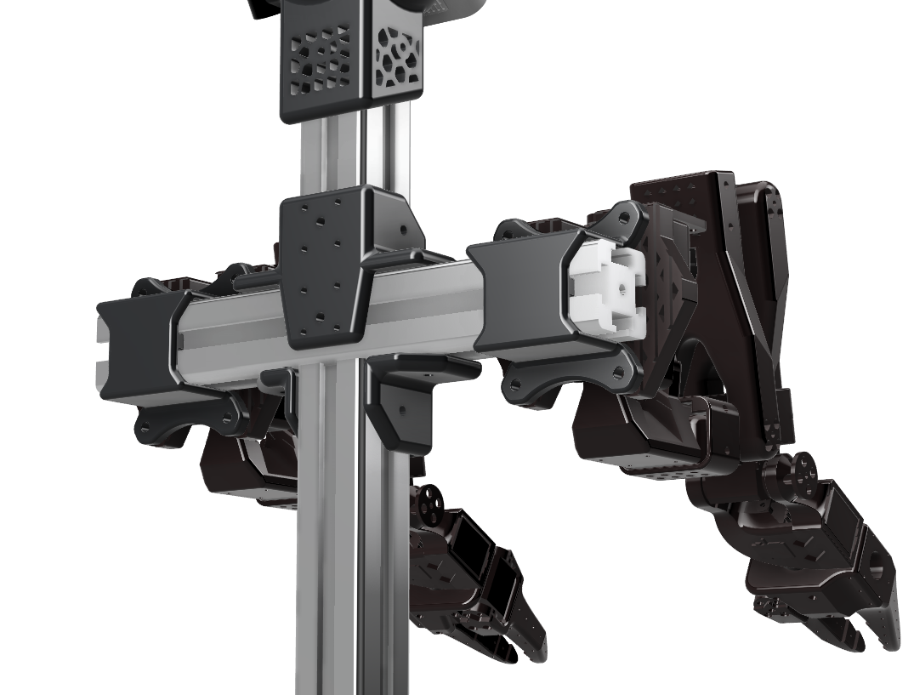
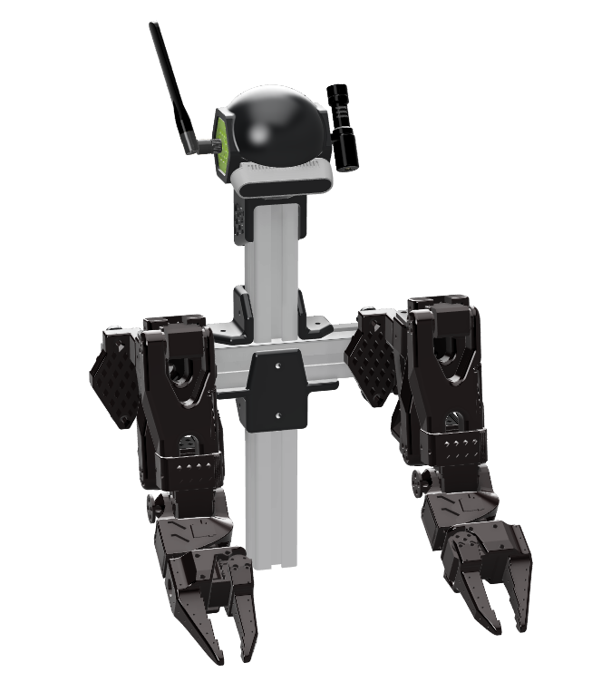
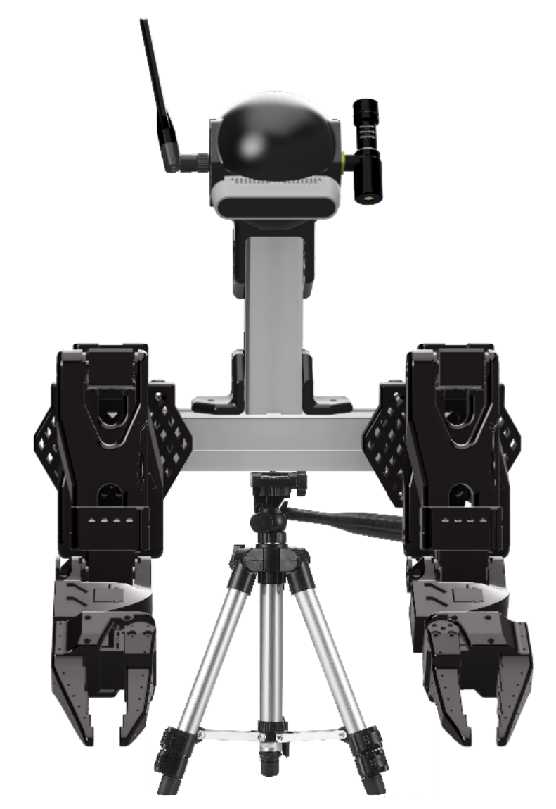
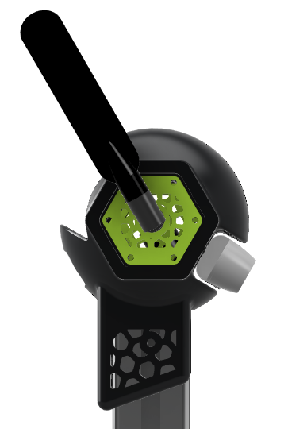

# AB-SO-BOT

Aluminium Body for Standard Open Arm (SO-ARM100)

## Modular Design

AB-SO-BOT is built using a combination of 3D-printed parts and 40mm aluminum extrusions to create a flexible and modular body for the SO-ARM100 robotic arms (https://github.com/TheRobotStudio/SO-ARM100). This modularity allows for easy customization, expansion, and adaptation for different robotic applications.

### 🔩 Component List

| Component Name        | Description                                             |
| --------------------- | ------------------------------------------------------- |
| SOARM100-4040-Adapter | Adapter to mount SO-ARM100 to 4040 extrusion            |
| ABSO-TSPINE           | Extrusion T-connector for modular assembly              |
| ABSO-TSPINE-ORP       | Open Robotic Platform-compatible version of T-connector |

### 🔧 Support Options

| Extrusion Mount                                              | Tripod Mount                                                 |
| ------------------------------------------------------------ | ------------------------------------------------------------ |
 | 
| Uses 4040 aluminum extrusions for a sturdy industrial setup. | Uses a camera tripod for a more flexible and portable setup. |
| Ideal for robotic workstations.                              | Great for mobile experiments.                                |

### 📡 Ear Module Options

| Module Name    | Image |
| -------------- | ----- |
| ABSO-EAR-USB   ||
| ABSO-EAR-USB2  ||
| ABSO-EAR-SMA   ||
| ABSO-EAR-BLANK ||
