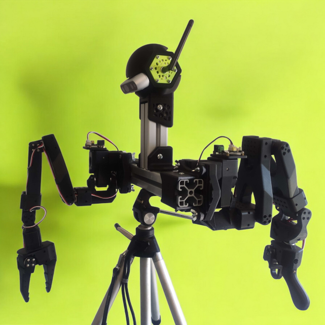

# AB-SO-BOT

**Aluminium Body for Standard Open Arm (SO-ARM100)**

## 🔩 Modular Design

AB-SO-BOT is built using a combination of <strong>3D-printed parts</strong> and standard <strong>4040 T-slot aluminium extrusions</strong> to create a customizable and modular body for the <a href="https://github.com/TheRobotStudio/SO-ARM100">SO-ARM100</a> robotic arm. ❤️  

This modularity allows for easy expansion and adaptation for different robotic applications.

|  | |
|:--:|:--:|

## 🤗 Compatible with LeRobot

State-of-the-art AI for real-world robotics  
👉 https://github.com/huggingface/lerobot

Also check out 🧪 **Phosphobot** for web control (GUI + API)  
👉 https://github.com/phospho-app/phosphobot

My Huggingface profile (Models & Datasets)  
👉 https://huggingface.co/MrC4t

| |  |
|:--:|:--:|

## 🎥 Watch the Demos on YouTube

| Autonomous 3D printing loop | First **AI** inference demo |
|:--:|:--:|
|  |  |

