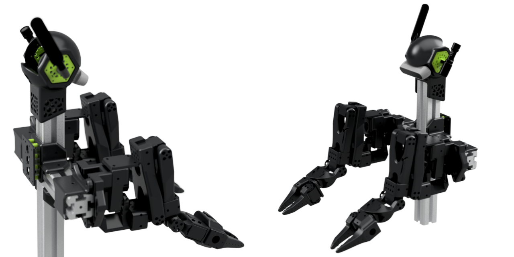

# AB-SO-BOT

Aluminium Body for Standard Open Arm (SO-ARM100)

## 🔩 Modular Design

AB-SO-BOT is built using a combination of 3D-printed parts and standard 4040-T-slot aluminium extrusion to create a flexible and modular body for the SO-ARM100 robotic arm.

SO-ARM100 
https://github.com/TheRobotStudio/SO-ARM100 ❤️

This modularity allows for easy customization, expansion, and adaptation for different robotic applications.

|  |  |
|----------------------------------------------|-------------------------------------------|

## 🤗 Compatible with LeRobot !
State-of-the-art AI for real-world robotics
https://github.com/huggingface/lerobot

Also check 🧪Phoshobot for web control (GUI + API)
https://github.com/phospho-app/phosphobot

## 🖥️Scripts
Automated 3D print loop using Creality KE websocket + Phosphobot robot API to clear the printer build-plate [Scripts/4DPrint.py](Scripts/4DPrint.py) 

