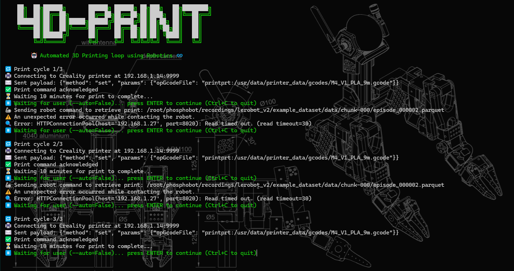

# AB-SO-BOT

**Aluminium Body for Standard Open Arm (SO-ARM100)**

## 🔩 Modular Design

<table>
  <tr>
    <td>

AB-SO-BOT is built using a combination of <strong>3D-printed parts</strong> and standard <strong>4040 T-slot aluminium extrusions</strong> to create a customizable and modular body for the <a href="https://github.com/TheRobotStudio/SO-ARM100">SO-ARM100</a> robotic arm. ❤️  
  
This modularity allows for easy expansion and adaptation for different robotic applications.

</td>
<td>
  
</td>
  </tr>
</table>

 

|  |  |  |
|:--:|:--:|:--:|

## 🤗 Compatible with LeRobot

State-of-the-art AI for real-world robotics  
👉 https://github.com/huggingface/lerobot

Also check out 🧪 **Phosphobot** for web control (GUI + API)  
👉 https://github.com/phospho-app/phosphobot

## 🎥 Watch the Demo on YouTube

Autonomous 3D printing loop using **Creality KE WebSocket** and **Phosphobot robot API**

