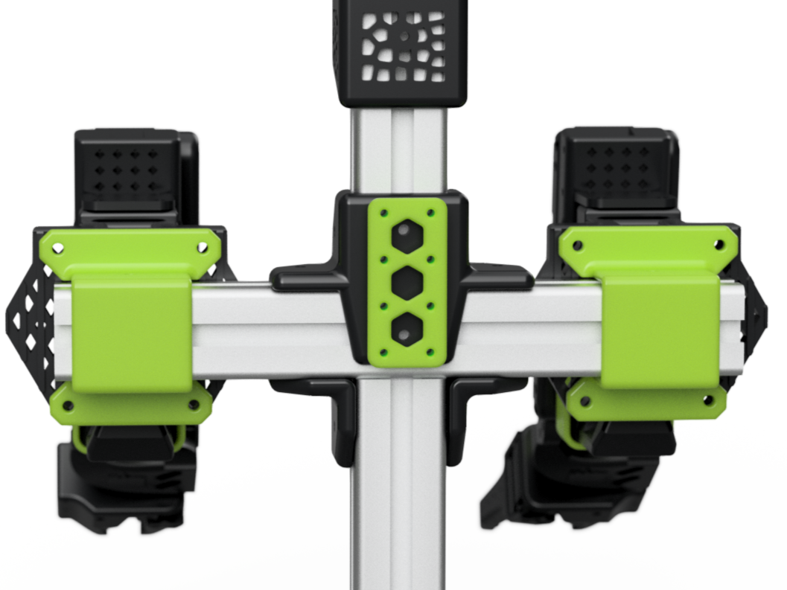
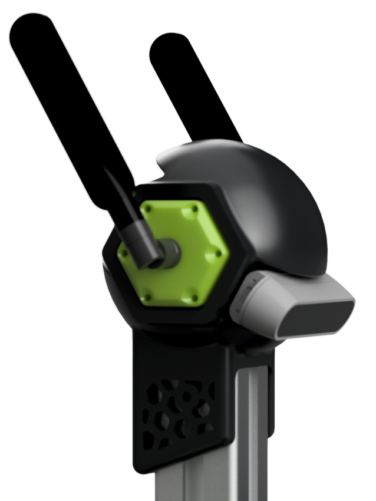

# AB-SO-BOT

**Aluminium Body for Standard Open Arm (SO-ARM100)**

## 🔩 Modular Design

AB-SO-BOT is built using a combination of <strong>3D-printed parts</strong> and standard <strong>4040 T-slot aluminium extrusions</strong> to create a customizable and modular body for the <a href="https://github.com/TheRobotStudio/SO-ARM100">SO-ARM100</a> robotic arm designed by TheRobotStudio and HuggingFace.❤️  

This modularity allows for easy expansion and adaptation for different robotic applications. From a compact workshop assistant mounted on a camera tripod, to a full humanoid-style bimanual setup using VR controllers teleoperation.

You can find mounting instructions for attaching the so-arm to 4040T profiles in the <a href="https://github.com/TheRobotStudio/SO-ARM100/blob/main/Optional/4040_Base_Mount/README.md">SO-ARM100 repository</a>.

|  | |
|:--:|:--:|

## 🤗 Compatible with LeRobot

State-of-the-art AI for real-world robotics  

Also check out 🧪 **Phosphobot** for web control (GUI + API) and VR bimanual teleoperation  

My Huggingface profile (Models & Datasets)  

  
  

> 🦾 **_AB-SO-BOT spotted in the 2025 LeRobot Worldwide Hackathon Kickoff video!_**  

## 🧩 3D Parts Overview

AB-SO-BOT is built from modular 3D-printed components, each designed to interface with standard M3/M4 hardware and 4040 aluminum extrusions.

📂 Browse all printable files here: [STL/](./STL/)

## 🦾 4040 Adaptor (Shoulder Mount)

Connects the SO-ARM100 base to 4040 extrusions.
See mounting <a href="https://github.com/TheRobotStudio/SO-ARM100/blob/main/Optional/4040_Base_Mount/README.md">instructions</a> in the SO-ARM100 repo.

The flat version is also available as a STEP file.

📐 [Download STEP file](STEP/SOARM100-4040-Adapter-V2.step)

<table>
  <tr>
    <td align="center" width="50%">
      <strong>4040-Adapter</strong> 
      <em>Flat version</em> 
      
    </td>
    <td align="center" width="50%">
      <strong>4040-Adapter-Curved</strong> 
      <em>Rounded style</em> 
      
    </td>
  </tr>
</table>

> Requires: M4 screws + wing nuts + T-slot nuts
## 🦴 T-Spine

Links horizontal and vertical extrusions. Also acts as the base for ORP mounting. 
[Open Robotic Platform](https://openroboticplatform.com/designrules)

<table>
  <tr>
    <td align="center" width="50%">
      <strong>TSPINE</strong> 
      <em>Standard connector</em> 
      
    </td>
    <td align="center" width="50%">
      <strong>TSPINE-ORP</strong> 
      <em>With 4×2 ORP</em> 
      
    </td>
  </tr>
</table>

> Requires: M4 screws + optional M3 hardware (orp version)
## 🧠 Head & Neck

Supports RealSense D435/D435i cameras. Comes in 2 parts: Head and Neck.
      
- <a href="STL/ABSO-NECK.stl">NECK</a>
- <a href="STL/ABSO-HEAD.stl">HEAD</a>

> Requires: M3 screws
## 👂 Ear
Side-mounted panels for USB, RF, or clean finishing. Fully interchangeable.
If you'd like to customize your own panel, the **Blank** version is also available as a STEP file. 

📐 [Download STEP file](STEP/ABSO-EAR-Basic.step)

<table>
  <tr>
    <td align="center" width="25%">
      <strong>SMA</strong> 
      
    </td>
    <td align="center" width="25%">
      <strong>Blank</strong> 
      
    </td>
    <td align="center" width="25%">
      <strong>USB</strong> 
      
    </td>
    <td align="center" width="25%">
      <strong>USB2</strong> 
      
    </td>
  </tr>
</table>

> Requires: M3 screws

## 🎥 Watch the Demos on YouTube

| Autonomous 3D printing loop | First **AI** inference demo |
|:--:|:--:|
|  |  |

## 🙌 Thanks for Your Support

If this project is useful or inspiring to you, feel free to give it a ⭐ so others can discover it too.  
You're more than welcome to ask questions, share ideas for improvement, or show off what you’ve built!

      
      

